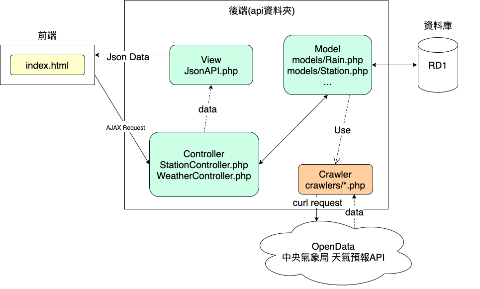

# RD1_Assignment: 個人氣象站

## 使用説明

1. 將此資料夾放到網站伺服器根目錄底下
2. 根據資料庫設定修改"api/cores/config.php"的內容dbuser 帳號, dbpass 密碼, dbhost 域名, dbport port
3. 將dbscript/script.txt的SQL語句拿到SQL commndline或phpmyadmin執行
4. 打開瀏覽器並輸入localhost/RD1_Assignment

## 專案說明

1. 製作一個個人氣象網站，並且實作以下功能:
    * 縣市選擇:可自行選擇要查看的縣市
    * 顯示縣市當前天氣狀況
    * 顯示縣市未來2天、1週天氣預報
    * 顯示縣市各觀測站過去1小時、24小時累積雨量數據
    * 切換縣市時，顯示該縣市的特色圖片
2. 上述各式氣象資料，儲存於資料庫

## 專案資料夾結構

```
.
├── README.md  -- 專案說明文件
├── api        -- 後端API所在資料夾
│   ├── controllers -- 控制器
│   │   ├── StationController.php -- 負責處理觀測站API的邏輯
│   │   └── WeatherController.php -- 負責處理天氣數據API的邏輯
│   ├── cores       -- 專案會用到的基本函式庫
│   │   ├── api.php         -- 創造一個API服務，並根據路徑提供不同的服務
│   │   ├── config.php      -- 專案會用到的相關設定( 資料庫與爬蟲網址相關路徑)
│   │   ├── controller.php  -- 控制器類別
│   │   └── crawler.php     -- 負責爬取中央氣象局資料的類別( 抽象類別，必須繼承客製化爬蟲)
│   ├── crawlers -- 客製化的爬蟲類別
│   │   ├── RainCrawler.php        -- 爬取雨量資料
│   │   ├── StationCrawler.php     -- 爬取觀測站資料
│   │   └── WeekWeatherCrawler.php -- 爬取天氣資料
│   ├── views -- 視圖
│   │   └── JsonAPI.php -- 輸出Json格式的API
│   ├── models -- 模型
│   │   ├── Rain.php               -- 雨量資料               
│   │   ├── Station.php            -- 觀測站資料
│   │   ├── StationUpdateTime.php  -- 觀測站數據更新時間
│   │   ├── Today.php              -- 今日天氣數據
│   │   ├── Twoday.php             -- 明後天氣數據
│   │   ├── WeatherUpdateTime.php  -- 天氣數據更新時間
│   │   └── Week.php               -- 一週天氣數據
│   ├── tests                      -- 測試用程式碼
│   └── index.php                  -- API預設首頁
│
├── css         -- css樣式
├── dbscript    -- SQL腳本
├── demo        -- 展示用圖片
├── image       -- 網站使用的圖片
├── index.html  -- 網站首頁
└── script
    ├── config.js -- 前端會使用到的相關數據
    └── script.js -- index.html 前端腳本
```
## 系統架構



## 資料庫實體關係圖


## 實作成果

首頁

一週天氣

各觀測站雨量資料


## 圖片出處
[天氣圖片](https://www.pinterest.com/pin/459015386992964638/)

## 參考資料
[中央氣象局開放資料平臺之資料擷取API](https://opendata.cwb.gov.tw/dist/opendata-swagger.html)
